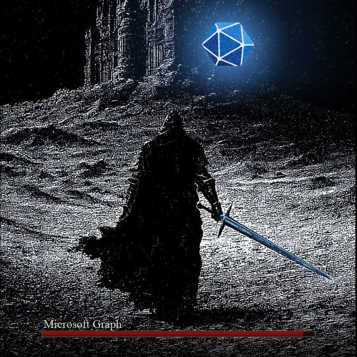

# graphslayer

<p align="center">
  
</p>

**Works with GCC High.** You can add commercial and GCC High tenants to the same server, and each
call names the tenant it uses. See [GCC High](#gcc-high).

graphslayer is an MCP server that lets an AI agent, such as Claude, read and change a Microsoft
365 tenant through Microsoft Graph. The agent writes a short JavaScript script, the server runs it
in a sandbox on your machine, and only the result the script returns goes back to the agent. One
script can page through every user, join them to their groups, and return ten rows, instead of
the agent pulling thousands of records into its context.

It has three tools, plus three for managing connections:

| Tool | What it does |
|---|---|
| `docs` | Searches the Microsoft Learn documentation and returns the matching passages with their links. |
| `search` | Runs a script over a built-in catalogue of Microsoft Graph: every path, method, property, and the permissions each call needs. It needs no tenant. |
| `execute` | Runs a script against one tenant. It reads, and through a connection added read-write, it also writes. |
| `connections_list`, `connection_add`, `connection_remove` | List, add and remove the tenants the server can reach. |

## Requirements

- Node.js 22 or newer. Check with `node --version`.
- macOS, Linux or Windows, on x64 or arm64.
- About 250 MB of disk. Most of it is `workerd`, the runtime the sandbox runs in.

On Linux, sign-ins are stored through the Secret Service. A desktop install already has it. A
server or minimal install needs it added:

```bash
sudo apt install gnome-keyring libsecret-1-0   # Debian, Ubuntu
sudo dnf install gnome-keyring libsecret       # Fedora, RHEL
```

Over SSH there is no session bus, so start the server with `dbus-run-session -- <command>`.

## Install

Add this to your MCP client's config:

```json
{
  "mcpServers": {
    "graphslayer": {
      "command": "npx",
      "args": ["-y", "graphslayer"]
    }
  }
}
```

In Claude Code it is one command:

```bash
claude mcp add graphslayer -- npx -y graphslayer
```

| Client | Config file |
|---|---|
| Claude Desktop, macOS | `~/Library/Application Support/Claude/claude_desktop_config.json` |
| Claude Desktop, Windows | `%APPDATA%\Claude\claude_desktop_config.json` |
| Claude Desktop, Linux | `~/.config/Claude/claude_desktop_config.json` |
| VS Code | `.vscode/mcp.json` in the workspace |

Restart the client after you edit the file.

## Connect a tenant

A connection is one signed-in tenant. You can hold several, and every tool call names the one it
uses. There are three kinds.

### As yourself

Ask the agent to add a connection, or run:

```bash
npx -y graphslayer connect --alias contoso
```

A browser window opens. Sign in with a work account and approve the permissions. The sign-in is
stored in your operating system's keychain: Keychain on macOS, Credential Manager on Windows, and
the Secret Service on Linux. Tokens and secrets never pass through the agent.

A connection is read-only unless you add it with `--template read-write`. Only then can
`execute` write through it.

### As an application

An app-only connection runs as your own app registration, with the application permissions an
administrator granted it. You add it from a terminal, because the agent never handles a
credential:

```bash
npx -y graphslayer connect --app-only --tenant <tenant-id> --client-id <your-app-id> --mode read
```

It asks for the client secret, or with `--cert <path>`, for the password of a PEM file holding
the certificate and its private key. The secret goes to the keychain. `--tenant`, `--client-id`
and `--mode` are required, and `--mode write` is what lets `execute` write.

### As an AI agent acting for you

An agent connection uses an Entra Agent ID agent identity. Graph sees you as the user and the
agent as the app, so Microsoft's sign-in log shows which calls the agent made for you. It works in
the commercial cloud.

First set up the agent in Entra: an agent identity blueprint with a certificate, an
`access_agent` scope on it, the Graph permissions granted to it and marked inheritable, and an
agent identity made from it. [docs/agent-setup.md](docs/agent-setup.md) walks through each step.
Then:

```bash
npx -y graphslayer connect --agent --tenant <tenant-id> --blueprint-id <blueprint-app-id> \
  --agent-id <agent-app-id> --cert <path-to-blueprint.pem> --mode read --alias agent
```

It asks for the certificate password, then opens a browser for you to sign in. Microsoft never
lets an agent identity hold `Application.ReadWrite.All`, `RoleManagement.ReadWrite.All`,
`User.ReadWrite.All` or `Directory.AccessAsUser.All`.

## Scripts

The agent writes the body of an async function and returns what it wants back. In `execute`,
the `graph` object makes the calls:

```js
const policies = await graph.all("/identity/conditionalAccess/policies", { select: ["displayName", "state"] });
return policies.filter((p) => p.state === "enabled").map((p) => p.displayName);
```

```js
return await graph.request({ method: "PATCH", path: "/users/{id}", body: { accountEnabled: false } });
```

| Call | What it does |
|---|---|
| `graph.get(path)` | Reads one object. |
| `graph.list(path)` | Reads one page, with a cursor for the next. |
| `graph.all(path)` | Reads every page, up to 2,000 items by default. |
| `graph.batch(requests)` | Sends up to 20 reads in one request. |
| `graph.count(path, filter)` | Counts the items in a collection. |
| `graph.request({ method, path, body })` | Sends any method. On a read-only connection, every method but GET is refused before anything is sent. |

The server handles the Graph details a script would otherwise get wrong:
- It sets the consistency header that advanced directory queries need.
- It waits and retries when Graph throttles. A write is resent only on a 429, because Graph may
  already have applied a write that came back with a 503 or 504.
- It answers a wrong path with the closest real ones.
- A collection read with no `select` asks for a small set of useful fields. A page of a hundred
  groups drops from about 223 kB to about 27 kB. Pass `select: ["*"]` for every field.

A script can make at most 200 Graph calls, and its output is capped at about 10,000 tokens.

In `search`, the script reads the `index` object instead. This returns the least-privileged
permission for listing Conditional Access policies:

```js
return index.paths["/identity/conditionalAccess/policies"]?.scopes?.get?.delegated;
```

### The sandbox

Scripts run in a fresh V8 isolate inside `workerd`, which the server starts on your machine. The
isolate has no file system and no network. Its only way out is a call back to the server, which
holds the token and makes the Graph request, so the token never enters the script. The `search`
sandbox has no network at all.

## GCC High

A connection names its cloud when you add it, and every call through it uses that cloud's
sign-in and Graph endpoints. One server can hold commercial and GCC High tenants at the same time.

```bash
npx -y graphslayer connect --cloud usgov-high --alias agency
```

| Cloud | Sign-in | Graph |
|---|---|---|
| `commercial` (default) | `login.microsoftonline.com` | `graph.microsoft.com` |
| `usgov-high` | `login.microsoftonline.us` | `graph.microsoft.us` |

GCC High tenants usually require a compliant device for sign-in. If the browser sign-in fails,
check that the machine is enrolled in the tenant before you suspect the server.

`search` takes `cloud: "usgov-high"` to use the GCC High catalogue. It leaves out the 2,739 paths
that GCC High does not have. Its permission data is copied from commercial, because Microsoft does
not publish a GCC High version, so treat it as a guide there.

## Where calls are recorded

graphslayer keeps no log of its own. Microsoft 365 records its calls in the tenant:

| Record | What it shows | What it needs |
|---|---|---|
| Entra sign-in log | Each sign-in, and for an agent connection, the agent and the person | Every tenant |
| Entra and workload audit logs | Each change: what changed, who made it, and when | Every tenant |
| Microsoft Graph activity logs | Every Graph request, reads included | Entra ID P1 or P2, and a diagnostic setting that sends the logs to Log Analytics, Storage or Event Hubs |

Every request carries `User-Agent: graphslayer/<version>`, so you can find the server's calls:

```kusto
MicrosoftGraphActivityLogs
| where UserAgent startswith "graphslayer/"
| project TimeGenerated, UserId, AppId, RequestMethod, RequestUri, ResponseStatusCode
```

An agent connection's calls are non-interactive sign-ins, which the sign-in log hides by default:

```
GET /beta/auditLogs/signIns?$filter=signInEventTypes/any(t: t eq 'nonInteractiveUser') and appId eq '<agent-app-id>'
```

## Configuration

| Variable | What it does |
|---|---|
| `GRAPHSLAYER_HOME` | Where connections and the token cache are kept. Default `~/.graphslayer`. |
| `GRAPHSLAYER_CLIENT_ID` | Your own public client app registration for sign-in. Default is Microsoft's Graph Command Line Tools app. |
| `GRAPHSLAYER_NO_TOKEN_CACHE` | Set to `1` to keep tokens in memory only. |

When your MCP client disconnects, the server shuts down `workerd` before it exits. If you kill the
server with `kill -9`, check for a leftover `workerd` process with `pgrep -fl workerd`.

## Development

```bash
git clone https://github.com/poamslayer/graphslayer.git
cd graphslayer
npm install
npm test
npm run build
node dist/cli/main.js --help
```

To run your build from an MCP client, use `"command": "node"` with
`"args": ["/absolute/path/to/graphslayer/dist/cli/main.js"]`. Node does not reload changed code,
so rebuild, then reconnect the client.

The design decisions are in `docs/adr`, and the project's vocabulary is in `CONTEXT.md`.

## Release

1. Rebuild the Graph catalogue from Microsoft's current metadata, and read the report it prints.
   A path listed as unclassified, or a type it could not resolve, means Microsoft changed a shape,
   so look at it before you ship. It needs python3 with PyYAML.

   ```bash
   npm run build:index -- --refresh
   npm test
   ```

2. Bump the version in a pull request and merge it.
3. Create the release: `gh release create v<version> --generate-notes`. A GitHub Actions workflow
   publishes it to npm through trusted publishing, with provenance. It needs no token.

## License

MIT
